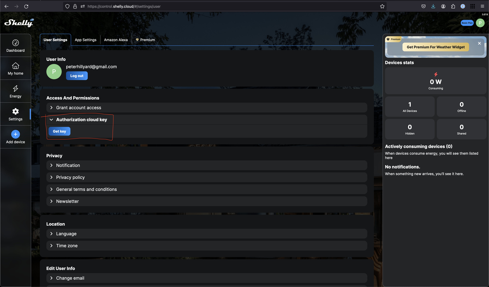

# garage-door
This project is meant to send an email notification if my garage door is open during certain hours of the day.

I have a Shelly 1 - UL relay hooked up to my garage door opener. On the relay is a GPIO that can read if a circuit is
open or closed. On this pin, I have connected a reed switch which is closed or opened when the garage door is closed or opened, respectively. When the garage door is closed, there is a magnet which is magnetically attached
to the garage at the same height as the reed switch. So if the garage door is at all open, the reed switch is open.
The figure below shows the setup.

[](./assets/garage-door-shelly.drawio.svg)


The python script makes a call to the Shelly cloud with an API key to get the state of the Shelly relay GPIO. If the state is OPEN, they the
script sends an email to list of email addresses every N minutes.

I have a raspberry pi that I wanted to run this on, so I have a service file as well that can be setup to run on boot and auto restart as needed.

## Getting API keys
There are a few requirements to run this script. First, you'll need python3.9. No 3rd party packages are needed. You will also need a Shelly API key, the shelly API endpoint and the Shelly relay device id. See images below on how to get those.



Next you will need a Brevo account. A free tier offers a generous number of emails per month. Obtain a new API key and the API endpoint. See the image below on where to get those. Look for the `Create and send transactional emails` option to find the endpoint.


## Running in development
Next you'll need to make a copy of [settings.example.sh](./dev_tools/settings.example.sh). Put the copy in the `dev_tools` folder and enter the environment variables. Note that the sender email should match the email you'd used to sign up for Brevo. The `awake_start_end_hours`.

To inject these environment variables into your shell, run `source ./dev_tools/<name_of_settings_file>.sh`. Then run `python main.py` to execute the script.

## Setup systemd service
The steps below are meant to be use on a raspberry pi or similar device to run the script as a systemd service on linux..

- Clone this repo using `git clone https://github.com/peterhillyard/garage-door.git` To have this script run as a systemd service on linux follow the steps below.
- Move into the `garage-door` directory
- Make a copy of the [garage-checker.example.serive](./garage-checker.example.service) file with `cp garage-checker.example.service garage-checker.service`. In the new file, 
-- populate the environment variables with your API keys, emails, etc
-- update the `ExecStart` value by specifying the path to the [main.py](./main.py) file
- Copy the [garage-checker.service](./garage-checker.service) to the systemd dir with `sudo cp garage-checker.service /etc/systemd/system/garage-checker.service`.
- Run `sudo systemctl daemon-reload`
- Run `sudo systemctl enable garage-checker.service`
- Run `sudo systemctl start garage-checker.service`

Your service should be running. Run `journalctl -f -u garage-checker.service` to see the logs.

If you ever need to update the service file, you'll need to run the following commands to make systemd recognize the changes. 
```bash
sudo systemctl stop garage-checker.service
sudo systemctl disable garage-checker.service
sudo rm /etc/systemd/system/garage-checker.service
sudo systemctl daemon-reload
sudo systemctl reset-failed

sudo cp garage-checker.service /etc/systemd/system/garage-checker.service
sudo systemctl daemon-reload
sudo systemctl enable garage-checker.service`
sudo systemctl start garage-checker.service`
```
